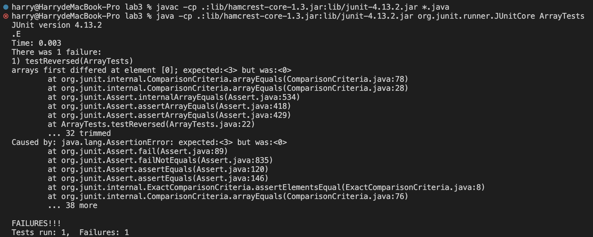
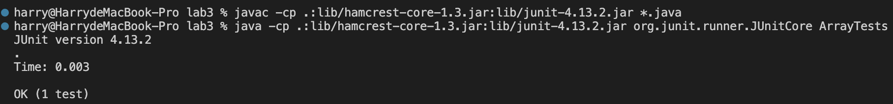

# Lab Report 3

## Part 1 - Bugs

Bug in method `reversed()`: <br>

- ## Input inducing failure:
```
@Test
  public void testReversed() {
    int[] input2 = {0, 1, 2, 3};
    assertArrayEquals(new int[]{3, 2, 1, 0}, ArrayExamples.reversed(input2));
  }
```
- ## Input that does not induce failure:
```
@Test
  public void testReversed() {
    int[] input1 = { };
    assertArrayEquals(new int[]{ }, ArrayExamples.reversed(input1));
  }
```
- ## Symptom

   Test Fail Screenshot:

  

   Test Pass Screenshot:

 

- ## Bug <br>
Original code:

```
  static int[] reversed(int[] arr) {
    int[] newArray = new int[arr.length];
    for(int i = 0; i < arr.length; i += 1) {
      arr[i] = newArray[arr.length - i - 1];
    }
    return arr;
  }
```


  Code after changing:

```
  static int[] reversed(int[] arr) {
    int[] newArray = new int[arr.length];
    for(int i = 0; i < arr.length; i += 1) {
      newArray[i] = arr[arr.length - i - 1];
    }
    return newArray;
  }
```

In the previous code, we changed elements in the old array `arr` by assigning each element in `arr` with the data of elements in the new array `newArray`. So, we switched `arr` and `newArray` in line 4, and made this method return `newArray`. In this way, the bug was successfully fixed and both these two inputs can pass the test.
